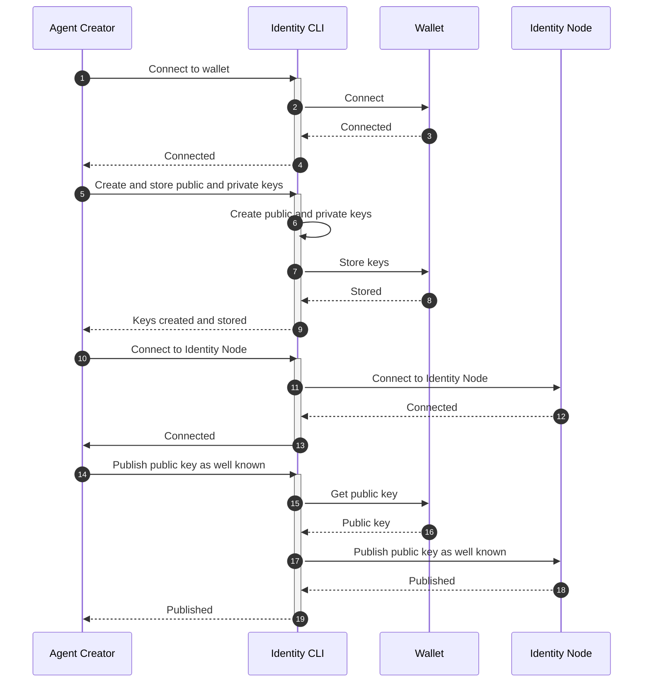
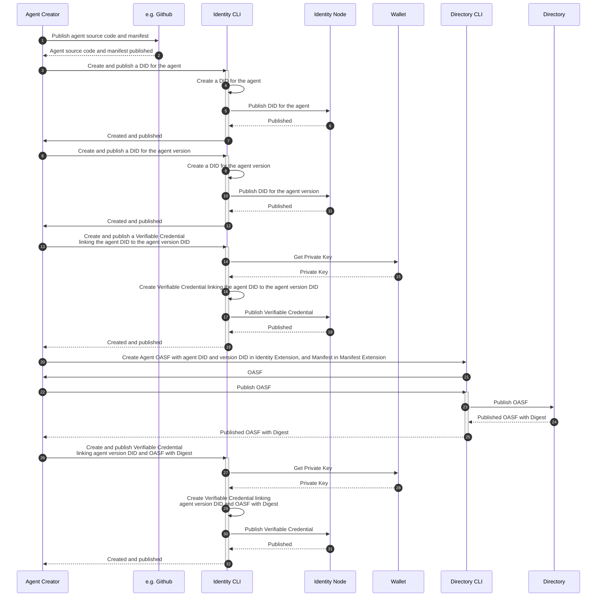
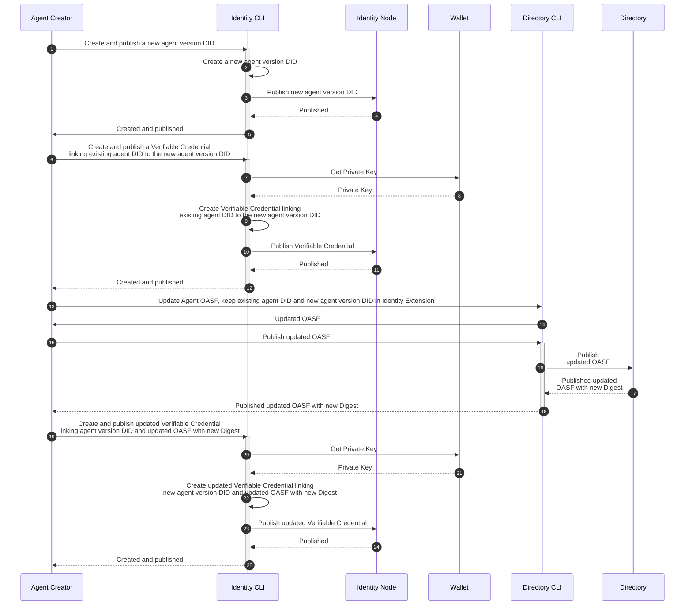
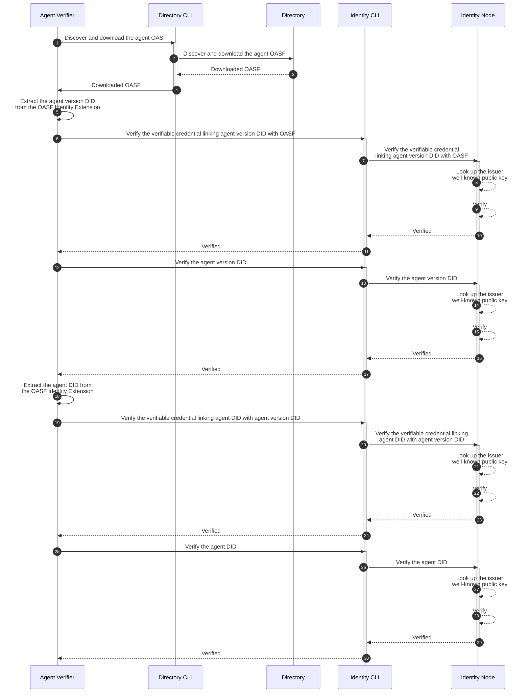

# Agntcy Flows

## Initial Identity Setup

```mermaid
sequenceDiagram
autonumber

% Connect to wallet
Agent Creator->>Identity CLI: Connect to wallet
activate Identity CLI
Identity CLI->>Wallet: Connect
Wallet-->>Identity CLI: Connected
Identity CLI-->>Agent Creator: Connected
deactivate Identity CLI

% Create public and private keys
Agent Creator->>Identity CLI: Create and store public and private keys
activate Identity CLI
Identity CLI->>Identity CLI: Create public and private keys
Identity CLI->>Wallet: Store keys
Wallet-->>Identity CLI: Stored
Identity CLI-->>Agent Creator: Keys created and stored
deactivate Identity CLI

% Connect to Identity Node
Agent Creator->>Identity CLI: Connect to Identity Node
activate Identity CLI
Identity CLI->>Identity Node: Connect to Identity Node
Identity Node-->>Identity CLI: Connected
Identity CLI->>Agent Creator: Connected
deactivate Identity CLI

% Publish public key as well known
Agent Creator->>Identity CLI: Publish public key as well known
activate Identity CLI
Identity CLI->>Wallet: Get public key
Wallet-->>Identity CLI: Public key
Identity CLI->>Identity Node: Publish public key as well known
Identity Node-->>Identity CLI: Published
Identity CLI-->>Agent Creator: Published
deactivate Identity CLI
```

## Create a new Agent

```mermaid
sequenceDiagram
autonumber

% Create a new agent
Agent Creator->>e.g. Github: Publish agent source code and manifest
e.g. Github-->>Agent Creator: Agent source code and manifest published

% Create a DID for the agent
Agent Creator->>Identity CLI: Create and publish a DID for the agent
activate Identity CLI
Identity CLI->>Identity CLI: Create a DID for the agent
Identity CLI->>Identity Node: Publish DID for the agent
Identity Node-->>Identity CLI: Published
Identity CLI->>Agent Creator: Created and published
deactivate Identity CLI

% Create a DID for the agent version
Agent Creator->>Identity CLI: Create and publish a DID for the agent version
activate Identity CLI
Identity CLI->>Identity CLI: Create a DID for the agent version
Identity CLI->>Identity Node: Publish DID for the agent version
Identity Node-->>Identity CLI: Published
Identity CLI->>Agent Creator: Created and published
deactivate Identity CLI

% Create + publish a Verifiable Credential linking the agent to the agent version
Agent Creator->>Identity CLI: Create and publish a Verifiable Credential<br/>linking the agent DID to the agent version DID
activate Identity CLI
Identity CLI->>Wallet: Get Private Key
Wallet-->>Identity CLI: Private Key
Identity CLI->>Identity CLI: Create Verifiable Credential linking the agent DID to the agent version DID
Identity CLI->>Identity Node: Publish Verifiable Credential
Identity Node-->>Identity CLI: Published
Identity CLI-->>Agent Creator: Created and published
deactivate Identity CLI

% Add DID to the agent's OASF
Agent Creator->>Directory CLI: Create Agent OASF with agent DID and version DID in Identity Extension, and Manifest in Manifest Extension
Directory CLI->>Agent Creator: OASF

% Publish agent OASF
Agent Creator->>Directory CLI: Publish OASF
activate Directory CLI
Directory CLI->>Directory: Publish OASF
Directory-->>Directory CLI: Published OASF with Digest
Directory CLI-->>Agent Creator: Published OASF with Digest
deactivate Directory CLI

% Create + Publish Verifiable Credential linking agent version DID + OASF with Digest
Agent Creator->>Identity CLI: Create and publish Verifiable Credential<br/>linking agent version DID and OASF with Digest
activate Identity CLI
Identity CLI->>Wallet: Get Private Key
Wallet-->>Identity CLI: Private Key
Identity CLI->>Identity CLI: Create Verifiable Credential linking<br/>agent version DID and OASF with Digest
Identity CLI->>Identity Node: Publish Verifiable Credential
Identity Node-->>Identity CLI: Published
Identity CLI-->>Agent Creator: Created and published
deactivate Identity CLI
```

## Update an existing Agent

```mermaid
sequenceDiagram
autonumber

% Create a new agent version DID
Agent Creator->>Identity CLI: Create and publish a new agent version DID
activate Identity CLI
Identity CLI->>Identity CLI: Create a new agent version DID
Identity CLI->>Identity Node: Publish new agent version DID
Identity Node-->>Identity CLI: Published
Identity CLI->>Agent Creator: Created and published
deactivate Identity CLI

% Create + publish a Verifiable Credential linking the agent to the new agent version
Agent Creator->>Identity CLI: Create and publish a Verifiable Credential<br/>linking existing agent DID to the new agent version DID
activate Identity CLI
Identity CLI->>Wallet: Get Private Key
Wallet-->>Identity CLI: Private Key
Identity CLI->>Identity CLI: Create Verifiable Credential linking<br/>existing agent DID to the new agent version DID
Identity CLI->>Identity Node: Publish Verifiable Credential
Identity Node-->>Identity CLI: Published
Identity CLI-->>Agent Creator: Created and published
deactivate Identity CLI

% Update the agent's OASF
Agent Creator->>Directory CLI: Update Agent OASF, keep existing agent DID and new agent version DID in Identity Extension
Directory CLI->>Agent Creator: Updated OASF

% Publish updated agent OASF
Agent Creator->>Directory CLI: Publish updated OASF
activate Directory CLI
Directory CLI->>Directory: Publish<br/>updated OASF
Directory-->>Directory CLI: Published updated<br/>OASF with new Digest
Directory CLI-->>Agent Creator: Published updated OASF with new Digest
deactivate Directory CLI

% Publish updated Verifiable Credential

Agent Creator->>Identity CLI: Create and publish updated Verifiable Credential<br/>linking agent version DID and updated OASF with new Digest
activate Identity CLI
Identity CLI->>Wallet: Get Private Key
Wallet-->>Identity CLI: Private Key
Identity CLI->>Identity CLI: Create updated Verifiable Credential linking<br/>new agent version DID and updated OASF with new Digest
Identity CLI->>Identity Node: Publish updated Verifiable Credential
Identity Node-->>Identity CLI: Published
Identity CLI-->>Agent Creator: Created and published
deactivate Identity CLI
```

## Verify an Agent

```mermaid
sequenceDiagram
autonumber

% Discover + download the agent OASF
Agent Verifier->>Directory CLI: Discover and download the agent OASF
activate Directory CLI
Directory CLI->>Directory: Discover and download the agent OASF
Directory-->>Directory CLI: Downloaded OASF
Directory CLI->>Agent Verifier: Downloaded OASF
deactivate Directory CLI

% Verify the agent version DID linking OASF verifiable credential
Agent Verifier->>Agent Verifier: Extract the agent version DID<br/>from the OASF Identity Extension
Agent Verifier->>Identity CLI: Verify the verifiable credential linking agent version DID with OASF 
activate Identity CLI
Identity CLI->>Identity Node: Verify the verifiable credential<br/>linking agent version DID with OASF 
activate Identity Node
Identity Node-->>Identity Node: Look up the issuer<br/>well-known public key
Identity Node-->>Identity Node: Verify
Identity Node-->>Identity CLI: Verified
deactivate Identity Node
Identity CLI-->>Agent Verifier: Verified
deactivate Identity CLI

% Verify the agent version DID
Agent Verifier->>Identity CLI: Verify the agent version DID
activate Identity CLI
Identity CLI->>Identity Node: Verify the agent version DID
activate Identity Node
Identity Node-->>Identity Node: Look up the issuer<br/>well-known public key
Identity Node-->>Identity Node: Verify
Identity Node-->>Identity CLI: Verified
deactivate Identity Node
Identity CLI-->>Agent Verifier: Verified
deactivate Identity CLI

% Verify the agent DID linking agent version DID verifiable credential
Agent Verifier->>Agent Verifier: Extract the agent DID from<br/>the OASF Identity Extension
Agent Verifier->>Identity CLI: Verify the verifiable credential linking agent DID with agent version DID
activate Identity CLI
Identity CLI->>Identity Node: Verify the verifiable credential linking<br/>agent DID with agent version DID
activate Identity Node
Identity Node-->>Identity Node: Look up the issuer<br/>well-known public key
Identity Node-->>Identity Node: Verify
Identity Node-->>Identity CLI: Verified
deactivate Identity Node
Identity CLI-->>Agent Verifier: Verified
deactivate Identity CLI

% Verify the agent DID
Agent Verifier->>Identity CLI: Verify the agent DID
activate Identity CLI
Identity CLI->>Identity Node: Verify the agent DID
activate Identity Node
Identity Node-->>Identity Node: Look up the issuer<br/>well-known public key
Identity Node-->>Identity Node: Verify
Identity Node-->>Identity CLI: Verified
deactivate Identity Node
Identity CLI-->>Agent Verifier: Verified
deactivate Identity CLI
```