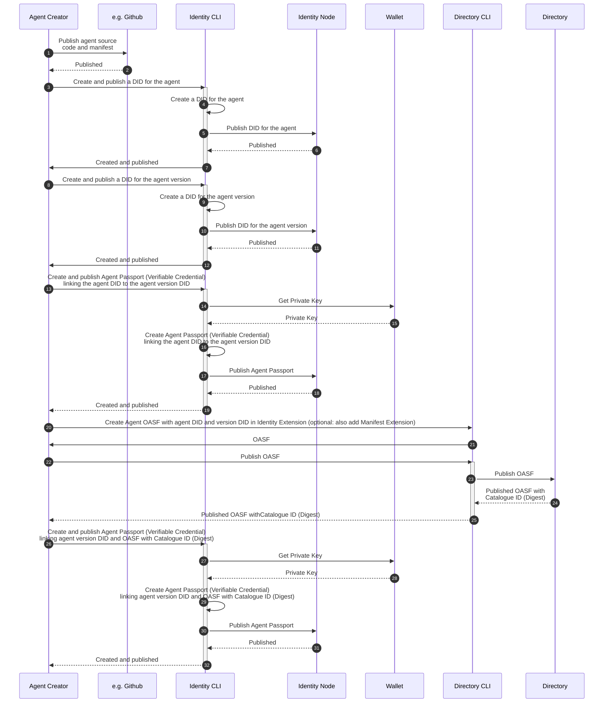
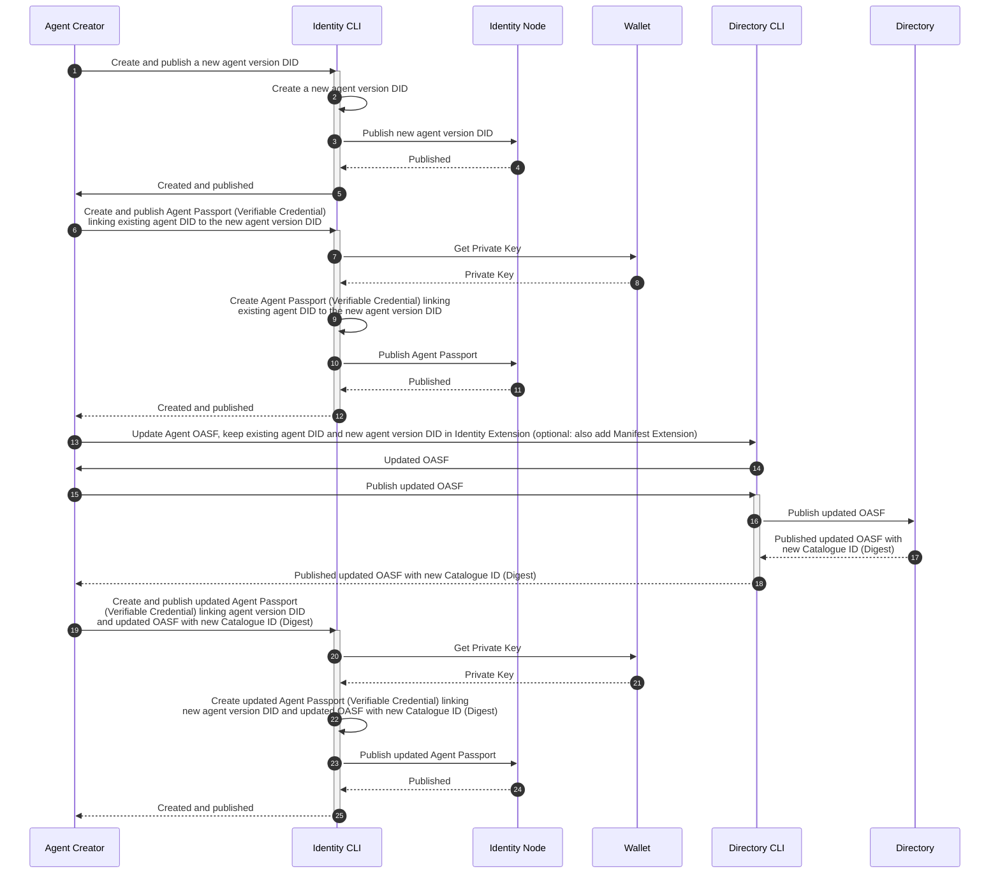
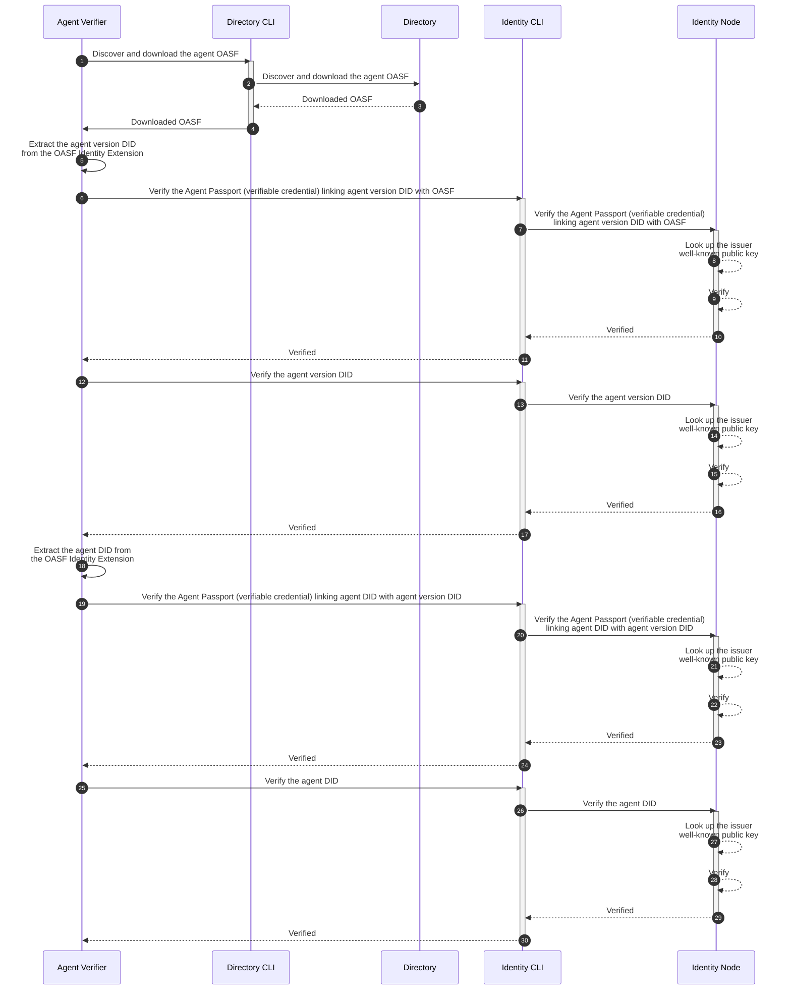

# Agntcy Flows

## Create a new Agent

```mermaid
sequenceDiagram
autonumber

% Create a new agent
Agent Creator->>e.g. Github: Publish agent source<br/>code and manifest
e.g. Github-->>Agent Creator: Published

% Create a DID for the agent
Agent Creator->>Identity CLI: Create and publish a DID for the agent
activate Identity CLI
Identity CLI->>Identity CLI: Create a DID for the agent
Identity CLI->>Identity Node: Publish DID for the agent
Identity Node-->>Identity CLI: Published
Identity CLI->>Agent Creator: Created and published
deactivate Identity CLI

% Create a DID for the agent version
Agent Creator->>Identity CLI: Create and publish a DID for the agent version
activate Identity CLI
Identity CLI->>Identity CLI: Create a DID for the agent version
Identity CLI->>Identity Node: Publish DID for the agent version
Identity Node-->>Identity CLI: Published
Identity CLI->>Agent Creator: Created and published
deactivate Identity CLI

% Create + publish a Verifiable Credential linking the agent to the agent version
Agent Creator->>Identity CLI: Create and publish Agent Passport (Verifiable Credential)<br/>linking the agent DID to the agent version DID
activate Identity CLI
Identity CLI->>Wallet: Get Private Key
Wallet-->>Identity CLI: Private Key
Identity CLI->>Identity CLI: Create Agent Passport (Verifiable Credential)<br/>linking the agent DID to the agent version DID
Identity CLI->>Identity Node: Publish Agent Passport
Identity Node-->>Identity CLI: Published
Identity CLI-->>Agent Creator: Created and published
deactivate Identity CLI

% Add DID to the agent's OASF
Agent Creator->>Directory CLI: Create Agent OASF with agent DID and version DID in Identity Extension (optional: also add Manifest Extension)
Directory CLI->>Agent Creator: OASF

% Publish agent OASF
Agent Creator->>Directory CLI: Publish OASF
activate Directory CLI
Directory CLI->>Directory: Publish OASF
Directory-->>Directory CLI: Published OASF with<br/>Catalogue ID (Digest)
Directory CLI-->>Agent Creator: Published OASF withCatalogue ID (Digest)
deactivate Directory CLI

% Create + Publish Verifiable Credential linking agent version DID + OASF with Catalogue ID (Digest)
Agent Creator->>Identity CLI: Create and publish Agent Passport (Verifiable Credential)<br/>linking agent version DID and OASF with Catalogue ID (Digest)
activate Identity CLI
Identity CLI->>Wallet: Get Private Key
Wallet-->>Identity CLI: Private Key
Identity CLI->>Identity CLI: Create Agent Passport (Verifiable Credential)<br/>linking agent version DID and OASF with Catalogue ID (Digest)
Identity CLI->>Identity Node: Publish Agent Passport
Identity Node-->>Identity CLI: Published
Identity CLI-->>Agent Creator: Created and published
deactivate Identity CLI
```

## Update an existing Agent

```mermaid
sequenceDiagram
autonumber

% Create a new agent version DID
Agent Creator->>Identity CLI: Create and publish a new agent version DID
activate Identity CLI
Identity CLI->>Identity CLI: Create a new agent version DID
Identity CLI->>Identity Node: Publish new agent version DID
Identity Node-->>Identity CLI: Published
Identity CLI->>Agent Creator: Created and published
deactivate Identity CLI

% Create + publish a Verifiable Credential linking the agent to the new agent version
Agent Creator->>Identity CLI: Create and publish Agent Passport (Verifiable Credential)<br/>linking existing agent DID to the new agent version DID
activate Identity CLI
Identity CLI->>Wallet: Get Private Key
Wallet-->>Identity CLI: Private Key
Identity CLI->>Identity CLI: Create Agent Passport (Verifiable Credential) linking<br/>existing agent DID to the new agent version DID
Identity CLI->>Identity Node: Publish Agent Passport
Identity Node-->>Identity CLI: Published
Identity CLI-->>Agent Creator: Created and published
deactivate Identity CLI

% Update the agent's OASF
Agent Creator->>Directory CLI: Update Agent OASF, keep existing agent DID and new agent version DID in Identity Extension (optional: also add Manifest Extension)
Directory CLI->>Agent Creator: Updated OASF

% Publish updated agent OASF
Agent Creator->>Directory CLI: Publish updated OASF
activate Directory CLI
Directory CLI->>Directory: Publish updated OASF
Directory-->>Directory CLI: Published updated OASF with<br/>new Catalogue ID (Digest)
Directory CLI-->>Agent Creator: Published updated OASF with new Catalogue ID (Digest)
deactivate Directory CLI

% Publish updated Verifiable Credential

Agent Creator->>Identity CLI: Create and publish updated Agent Passport<br/>(Verifiable Credential) linking agent version DID<br/>and updated OASF with new Catalogue ID (Digest)
activate Identity CLI
Identity CLI->>Wallet: Get Private Key
Wallet-->>Identity CLI: Private Key
Identity CLI->>Identity CLI: Create updated Agent Passport (Verifiable Credential) linking<br/>new agent version DID and updated OASF with new Catalogue ID (Digest)
Identity CLI->>Identity Node: Publish updated Agent Passport
Identity Node-->>Identity CLI: Published
Identity CLI-->>Agent Creator: Created and published
deactivate Identity CLI
```

## Verify an Agent

```mermaid
sequenceDiagram
autonumber

% Discover + download the agent OASF
Agent Verifier->>Directory CLI: Discover and download the agent OASF
activate Directory CLI
Directory CLI->>Directory: Discover and download the agent OASF
Directory-->>Directory CLI: Downloaded OASF
Directory CLI->>Agent Verifier: Downloaded OASF
deactivate Directory CLI

% Verify the agent version DID linking OASF verifiable credential
Agent Verifier->>Agent Verifier: Extract the agent version DID<br/>from the OASF Identity Extension
Agent Verifier->>Identity CLI: Verify the Agent Passport (verifiable credential) linking agent version DID with OASF
activate Identity CLI
Identity CLI->>Identity Node: Verify the Agent Passport (verifiable credential)<br/>linking agent version DID with OASF
activate Identity Node
Identity Node-->>Identity Node: Look up the issuer<br/>well-known public key
Identity Node-->>Identity Node: Verify
Identity Node-->>Identity CLI: Verified
deactivate Identity Node
Identity CLI-->>Agent Verifier: Verified
deactivate Identity CLI

% Verify the agent version DID
Agent Verifier->>Identity CLI: Verify the agent version DID
activate Identity CLI
Identity CLI->>Identity Node: Verify the agent version DID
activate Identity Node
Identity Node-->>Identity Node: Look up the issuer<br/>well-known public key
Identity Node-->>Identity Node: Verify
Identity Node-->>Identity CLI: Verified
deactivate Identity Node
Identity CLI-->>Agent Verifier: Verified
deactivate Identity CLI

% Verify the agent DID linking agent version DID verifiable credential
Agent Verifier->>Agent Verifier: Extract the agent DID from<br/>the OASF Identity Extension
Agent Verifier->>Identity CLI: Verify the Agent Passport (verifiable credential) linking agent DID with agent version DID
activate Identity CLI
Identity CLI->>Identity Node: Verify the Agent Passport (verifiable credential)<br/>linking agent DID with agent version DID
activate Identity Node
Identity Node-->>Identity Node: Look up the issuer<br/>well-known public key
Identity Node-->>Identity Node: Verify
Identity Node-->>Identity CLI: Verified
deactivate Identity Node
Identity CLI-->>Agent Verifier: Verified
deactivate Identity CLI

% Verify the agent DID
Agent Verifier->>Identity CLI: Verify the agent DID
activate Identity CLI
Identity CLI->>Identity Node: Verify the agent DID
activate Identity Node
Identity Node-->>Identity Node: Look up the issuer<br/>well-known public key
Identity Node-->>Identity Node: Verify
Identity Node-->>Identity CLI: Verified
deactivate Identity Node
Identity CLI-->>Agent Verifier: Verified
deactivate Identity CLI
```
