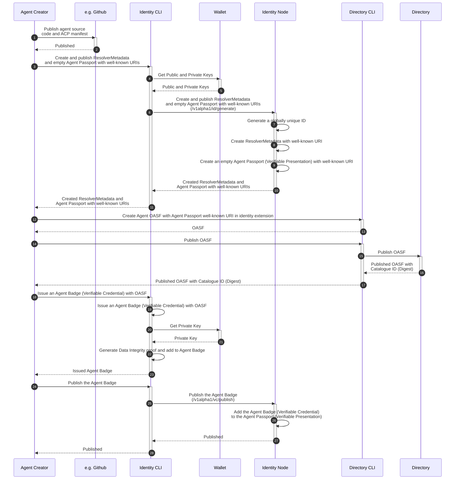
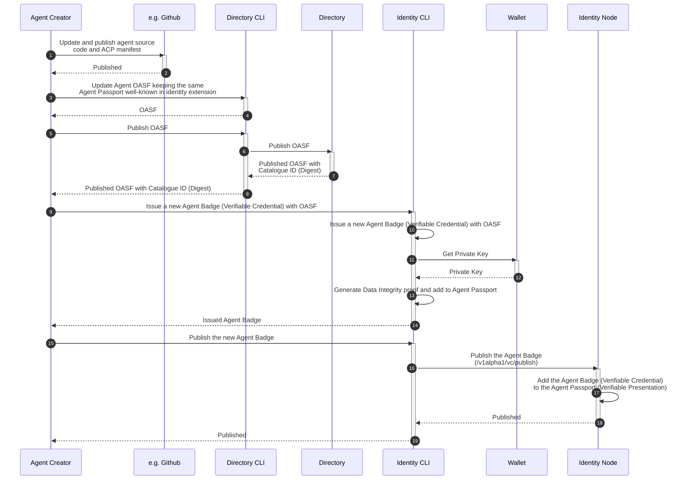
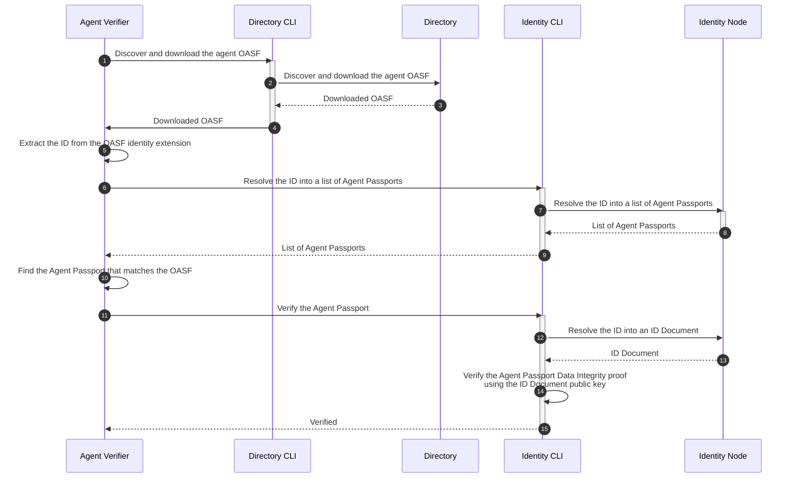
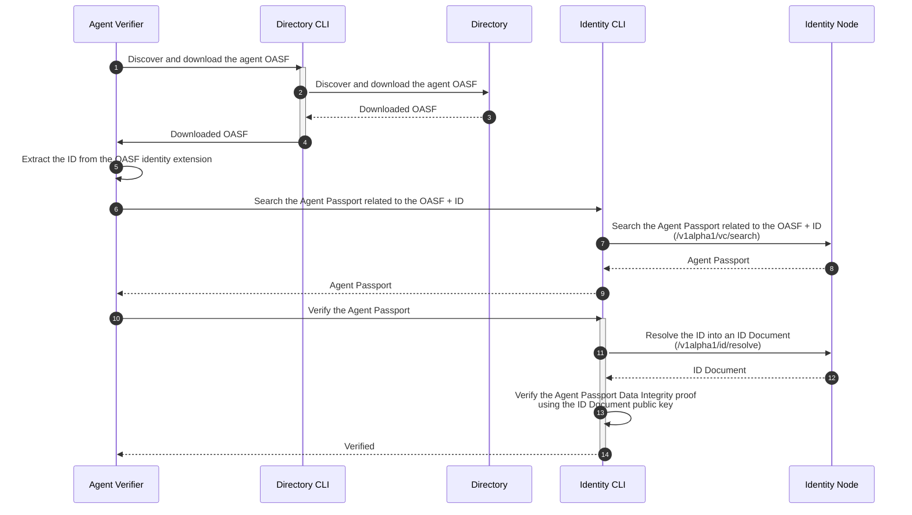

# Agntcy Flows

## Create a New Agent

```mermaid
sequenceDiagram
autonumber

% Create a new agent
Agent Creator->>e.g. Github: Publish agent source<br/>code and ACP manifest
activate e.g. Github
e.g. Github-->>Agent Creator: Published
deactivate e.g. Github

% Create and publish ResolverMetadata and Agent Passport with well-known URIs
Agent Creator->>Identity CLI: Create and publish ResolverMetadata<br/>and empty Agent Passport with well-known URIs
activate Identity CLI
Identity CLI->>Wallet: Get Public and Private Keys
activate Wallet
Wallet-->>Identity CLI: Public and Private Keys
deactivate Wallet
Identity CLI->>Identity Node: Create and publish ResolverMetadata<br/>and empty Agent Passport with well-known URIs<br/>(/v1alpha1/id/generate)
activate Identity Node
Identity Node->>Identity Node: Generate a globally unique ID
Identity Node->>Identity Node: Create ResolverMetadata with well-known URI
Identity Node->>Identity Node: Create an empty Agent Passport (Verifiable Presentation) with well-known URI
Identity Node-->>Identity CLI: Created ResolverMetadata and<br/>Agent Passport with well-known URIs
deactivate Identity Node
Identity CLI-->>Agent Creator: Created ResolverMetadata and<br/>Agent Passport with well-known URIs
deactivate Identity CLI

% Create the agent's OASF and add Agent Passport well-known URI
Agent Creator->>Directory CLI: Create Agent OASF with Agent Passport well-known URI in identity extension
activate Directory CLI
Directory CLI-->>Agent Creator: OASF
deactivate Directory CLI

% Publish agent OASF
Agent Creator->>Directory CLI: Publish OASF
activate Directory CLI
Directory CLI->>Directory: Publish OASF
activate Directory
Directory-->>Directory CLI: Published OASF with<br/>Catalogue ID (Digest)
deactivate Directory
Directory CLI-->>Agent Creator: Published OASF with Catalogue ID (Digest)
deactivate Directory CLI

% Issue Agent Badge linking agent ID + OASF
Agent Creator->>Identity CLI: Issue an Agent Badge (Verifiable Credential) with OASF
activate Identity CLI
Identity CLI->>Identity CLI: Issue an Agent Badge (Verifiable Credential) with OASF
Identity CLI->>Wallet: Get Private Key
activate Wallet
Wallet-->>Identity CLI: Private Key
deactivate Wallet
Identity CLI->>Identity CLI: Generate Data Integrity proof and add to Agent Badge
Identity CLI-->>Agent Creator: Issued Agent Badge
deactivate Identity CLI

% Publish the Agent Badge
Agent Creator->>Identity CLI: Publish the Agent Badge
activate Identity CLI
Identity CLI->>Identity Node: Publish the Agent Badge<br/>(/v1alpha1/vc/publish)
activate Identity Node
Identity Node->>Identity Node: Add the Agent Badge (Verifiable Credential)<br/>to the Agent Passport (Verifiable Presentation)
Identity Node-->>Identity CLI: Published
deactivate Identity Node
Identity CLI-->>Agent Creator: Published
deactivate Identity CLI

```

## Update an Agent

```mermaid
sequenceDiagram
autonumber

% Update an existing agent
Agent Creator->>e.g. Github: Update and publish agent source<br/>code and ACP manifest
activate e.g. Github
e.g. Github-->>Agent Creator: Published
deactivate e.g. Github

% Update the agent's OASF
Agent Creator->>Directory CLI: Update Agent OASF keeping the same<br/>Agent Passport well-known in identity extension
activate Directory CLI
Directory CLI-->>Agent Creator: OASF
deactivate Directory CLI

% Publish agent OASF
Agent Creator->>Directory CLI: Publish OASF
activate Directory CLI
Directory CLI->>Directory: Publish OASF
activate Directory
Directory-->>Directory CLI: Published OASF with<br/>Catalogue ID (Digest)
deactivate Directory
Directory CLI-->>Agent Creator: Published OASF with Catalogue ID (Digest)
deactivate Directory CLI

% Create a new Verifiable Credential linking agent ID + OASF
Agent Creator->>Identity CLI: Issue a new Agent Badge (Verifiable Credential) with OASF
activate Identity CLI
Identity CLI->>Identity CLI: Issue a new Agent Badge (Verifiable Credential) with OASF
Identity CLI->>Wallet: Get Private Key
activate Wallet
Wallet-->>Identity CLI: Private Key
deactivate Wallet
Identity CLI->>Identity CLI: Generate Data Integrity proof and add to Agent Passport
Identity CLI-->>Agent Creator: Issued Agent Badge
deactivate Identity CLI

% Publish the Verifiable Credential
Agent Creator->>Identity CLI: Publish the new Agent Badge
activate Identity CLI
Identity CLI->>Identity Node: Publish the Agent Badge<br/>(/v1alpha1/vc/publish)
activate Identity Node
Identity Node->>Identity Node: Add the Agent Badge (Verifiable Credential)<br/>to the Agent Passport (Verifiable Presentation)
Identity Node-->>Identity CLI: Published
deactivate Identity Node
Identity CLI-->>Agent Creator: Published
deactivate Identity CLI
```

## Verify an Agent Locally

```mermaid
sequenceDiagram
autonumber

% Discover + download the agent OASF
Agent Verifier->>Directory CLI: Discover and download the agent OASF
activate Directory CLI
Directory CLI->>Directory: Discover and download the agent OASF
Directory-->>Directory CLI: Downloaded OASF
Directory CLI->>Agent Verifier: Downloaded OASF
deactivate Directory CLI

Agent Verifier->>Agent Verifier: Extract the ID from the OASF identity extension

% Resolve the ID into a list of Agent Passports
Agent Verifier->>Identity CLI: Resolve the ID into a list of Agent Passports
activate Identity CLI
Identity CLI->>Identity Node: Resolve the ID into a list of Agent Passports
activate Identity Node
Identity Node-->>Identity CLI: List of Agent Passports
deactivate Identity Node
Identity CLI-->>Agent Verifier: List of Agent Passports
deactivate Identity CLI

% Find and verify the Agent Passport
Agent Verifier->>Agent Verifier: Find the Agent Passport that matches the OASF
Agent Verifier->>Identity CLI: Verify the Agent Passport
activate Identity CLI
Identity CLI->>Identity Node: Resolve the ID into an ID Document
Identity Node-->>Identity CLI: ID Document
Identity CLI->>Identity CLI: Verify the Agent Passport Data Integrity proof<br/>using the ID Document public key
Identity CLI-->>Agent Verifier: Verified
deactivate Identity CLI
```

## Verify an Agent Using Search Endpoint

```mermaid
sequenceDiagram
autonumber

% Discover + download the agent OASF
Agent Verifier->>Directory CLI: Discover and download the agent OASF
activate Directory CLI
Directory CLI->>Directory: Discover and download the agent OASF
Directory-->>Directory CLI: Downloaded OASF
Directory CLI->>Agent Verifier: Downloaded OASF
deactivate Directory CLI

Agent Verifier->>Agent Verifier: Extract the ID from the OASF identity extension

Agent Verifier->>Identity CLI: Search the Agent Passport related to the OASF + ID
Identity CLI->>Identity Node: Search the Agent Passport related to the OASF + ID<br/>(/v1alpha1/vc/search)
Identity Node-->>Identity CLI: Agent Passport
Identity CLI-->>Agent Verifier: Agent Passport

% Find and verify the Agent Passport
Agent Verifier->>Identity CLI: Verify the Agent Passport
activate Identity CLI
Identity CLI->>Identity Node: Resolve the ID into an ID Document<br/>(/v1alpha1/id/resolve)
Identity Node-->>Identity CLI: ID Document
Identity CLI->>Identity CLI: Verify the Agent Passport Data Integrity proof<br/>using the ID Document public key
Identity CLI-->>Agent Verifier: Verified
deactivate Identity CLI
```
