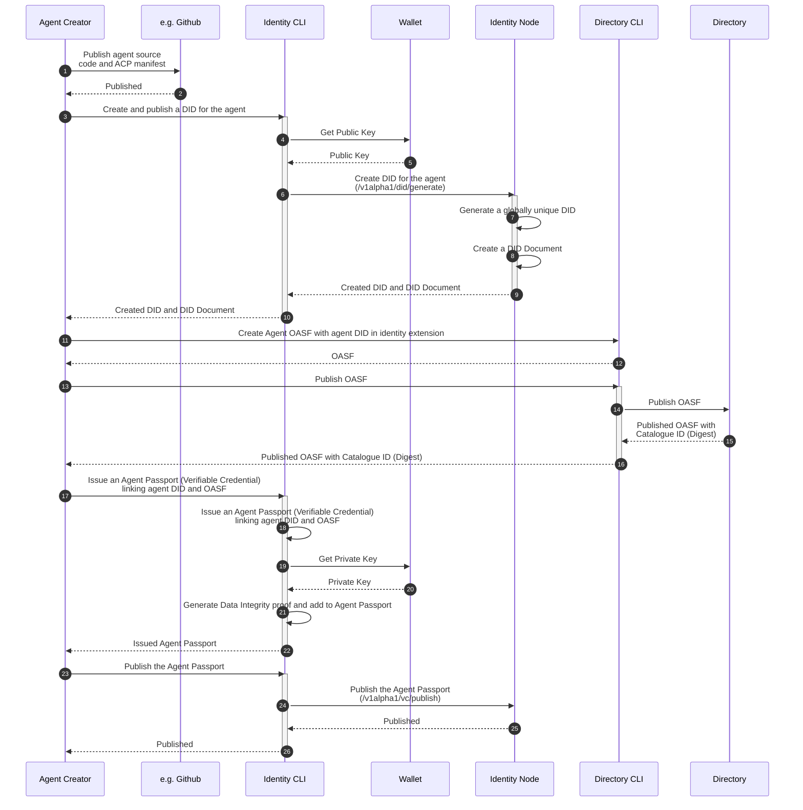
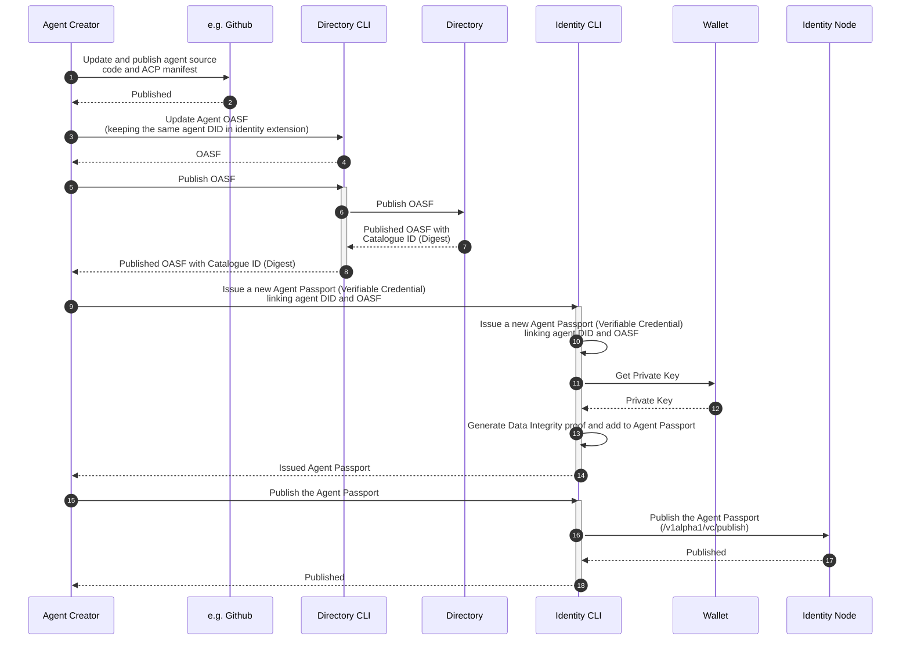
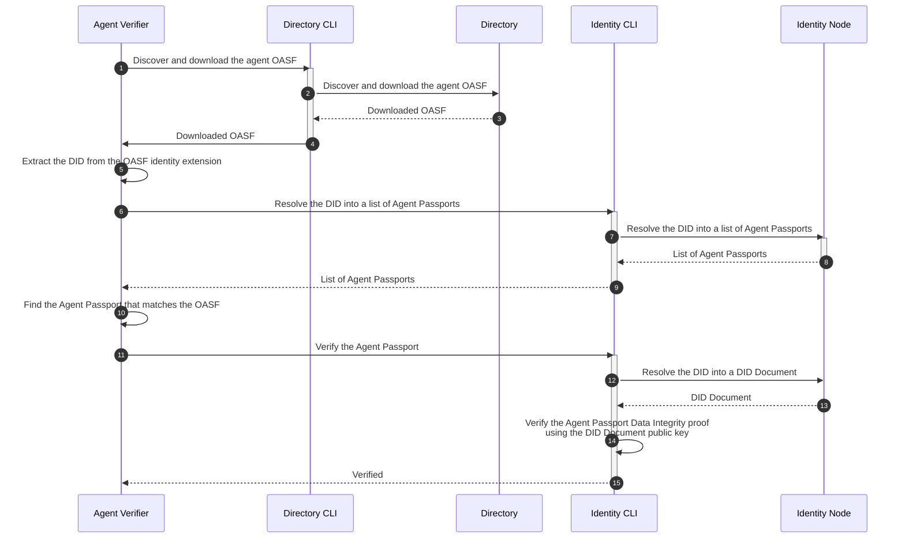
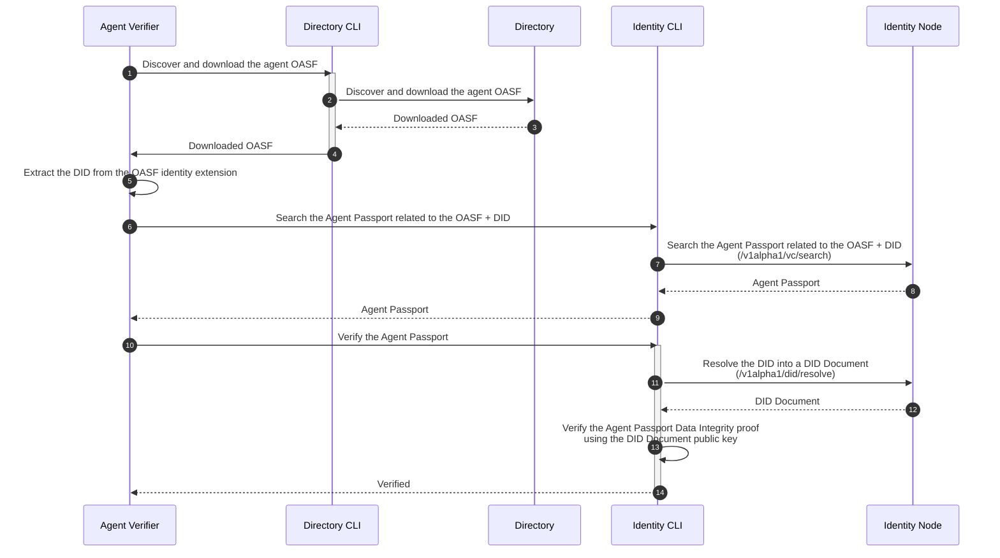

# Agntcy Flows

## Create a New Agent (Register)

```mermaid
sequenceDiagram
autonumber

% Create a new agent
Agent Creator->>e.g. Github: Publish agent source<br/>code and ACP manifest
e.g. Github-->>Agent Creator: Published

% Create a DID and a DID Document for the agent
Agent Creator->>Identity CLI: Create and publish a DID for the agent
activate Identity CLI
Identity CLI->>Wallet: Get Public Key
Wallet-->>Identity CLI: Public Key
Identity CLI->>Identity Node: Create DID for the agent<br/>(/v1alpha1/did/generate)
activate Identity Node
Identity Node->>Identity Node: Generate a globally unique DID
Identity Node->>Identity Node: Create a DID Document
Identity Node-->>Identity CLI: Created DID and DID Document
deactivate Identity Node
Identity CLI-->>Agent Creator: Created DID and DID Document
deactivate Identity CLI

% Create the agent's OASF and add DID to it
Agent Creator->>Directory CLI: Create Agent OASF with agent DID in identity extension
Directory CLI-->>Agent Creator: OASF

% Publish agent OASF
Agent Creator->>Directory CLI: Publish OASF
activate Directory CLI
Directory CLI->>Directory: Publish OASF
Directory-->>Directory CLI: Published OASF with<br/>Catalogue ID (Digest)
Directory CLI-->>Agent Creator: Published OASF with Catalogue ID (Digest)
deactivate Directory CLI

% Create Verifiable Credential linking agent DID + OASF
Agent Creator->>Identity CLI: Issue an Agent Passport (Verifiable Credential)<br/>linking agent DID and OASF
activate Identity CLI
Identity CLI->>Identity CLI: Issue an Agent Passport (Verifiable Credential)<br/>linking agent DID and OASF
Identity CLI->>Wallet: Get Private Key
Wallet-->>Identity CLI: Private Key
Identity CLI->>Identity CLI: Generate Data Integrity proof and add to Agent Passport
Identity CLI-->>Agent Creator: Issued Agent Passport
deactivate Identity CLI

% Publish the Verifiable Credential
Agent Creator->>Identity CLI: Publish the Agent Passport
activate Identity CLI
Identity CLI->>Identity Node: Publish the Agent Passport<br/>(/v1alpha1/vc/publish)
Identity Node-->>Identity CLI: Published
Identity CLI-->>Agent Creator: Published
deactivate Identity CLI
```

## Update an Agent (Update)

```mermaid
sequenceDiagram
autonumber

% Update an existing agent
Agent Creator->>e.g. Github: Update and publish agent source<br/>code and ACP manifest
e.g. Github-->>Agent Creator: Published

% Update the agent's OASF
Agent Creator->>Directory CLI: Update Agent OASF<br/>(keeping the same agent DID in identity extension)
Directory CLI-->>Agent Creator: OASF

% Publish agent OASF
Agent Creator->>Directory CLI: Publish OASF
activate Directory CLI
Directory CLI->>Directory: Publish OASF
Directory-->>Directory CLI: Published OASF with<br/>Catalogue ID (Digest)
Directory CLI-->>Agent Creator: Published OASF with Catalogue ID (Digest)
deactivate Directory CLI

% Create a new Verifiable Credential linking agent DID + OASF
Agent Creator->>Identity CLI: Issue a new Agent Passport (Verifiable Credential)<br/>linking agent DID and OASF
activate Identity CLI
Identity CLI->>Identity CLI: Issue a new Agent Passport (Verifiable Credential)<br/>linking agent DID and OASF
Identity CLI->>Wallet: Get Private Key
Wallet-->>Identity CLI: Private Key
Identity CLI->>Identity CLI: Generate Data Integrity proof and add to Agent Passport
Identity CLI-->>Agent Creator: Issued Agent Passport
deactivate Identity CLI

% Publish the Verifiable Credential
Agent Creator->>Identity CLI: Publish the Agent Passport
activate Identity CLI
Identity CLI->>Identity Node: Publish the Agent Passport<br/>(/v1alpha1/vc/publish)
Identity Node-->>Identity CLI: Published
Identity CLI-->>Agent Creator: Published
deactivate Identity CLI
```

## Verify an Agent Locally

```mermaid
sequenceDiagram
autonumber

% Discover + download the agent OASF
Agent Verifier->>Directory CLI: Discover and download the agent OASF
activate Directory CLI
Directory CLI->>Directory: Discover and download the agent OASF
Directory-->>Directory CLI: Downloaded OASF
Directory CLI->>Agent Verifier: Downloaded OASF
deactivate Directory CLI

Agent Verifier->>Agent Verifier: Extract the DID from the OASF identity extension

% Resolve the DID into a list of Agent Passports
Agent Verifier->>Identity CLI: Resolve the DID into a list of Agent Passports
activate Identity CLI
Identity CLI->>Identity Node: Resolve the DID into a list of Agent Passports
activate Identity Node
Identity Node-->>Identity CLI: List of Agent Passports
deactivate Identity Node
Identity CLI-->>Agent Verifier: List of Agent Passports
deactivate Identity CLI

% Find and verify the Agent Passport
Agent Verifier->>Agent Verifier: Find the Agent Passport that matches the OASF
Agent Verifier->>Identity CLI: Verify the Agent Passport
activate Identity CLI
Identity CLI->>Identity Node: Resolve the DID into a DID Document
Identity Node-->>Identity CLI: DID Document
Identity CLI->>Identity CLI: Verify the Agent Passport Data Integrity proof<br/>using the DID Document public key
Identity CLI-->>Agent Verifier: Verified
deactivate Identity CLI
```

## Verify an Agent Using Search Endpoint

```mermaid
sequenceDiagram
autonumber

% Discover + download the agent OASF
Agent Verifier->>Directory CLI: Discover and download the agent OASF
activate Directory CLI
Directory CLI->>Directory: Discover and download the agent OASF
Directory-->>Directory CLI: Downloaded OASF
Directory CLI->>Agent Verifier: Downloaded OASF
deactivate Directory CLI

Agent Verifier->>Agent Verifier: Extract the DID from the OASF identity extension

Agent Verifier->>Identity CLI: Search the Agent Passport related to the OASF + DID
Identity CLI->>Identity Node: Search the Agent Passport related to the OASF + DID<br/>(/v1alpha1/vc/search)
Identity Node-->>Identity CLI: Agent Passport
Identity CLI-->>Agent Verifier: Agent Passport

% Find and verify the Agent Passport
Agent Verifier->>Identity CLI: Verify the Agent Passport
activate Identity CLI
Identity CLI->>Identity Node: Resolve the DID into a DID Document<br/>(/v1alpha1/did/resolve)
Identity Node-->>Identity CLI: DID Document
Identity CLI->>Identity CLI: Verify the Agent Passport Data Integrity proof<br/>using the DID Document public key
Identity CLI-->>Agent Verifier: Verified
deactivate Identity CLI
```
