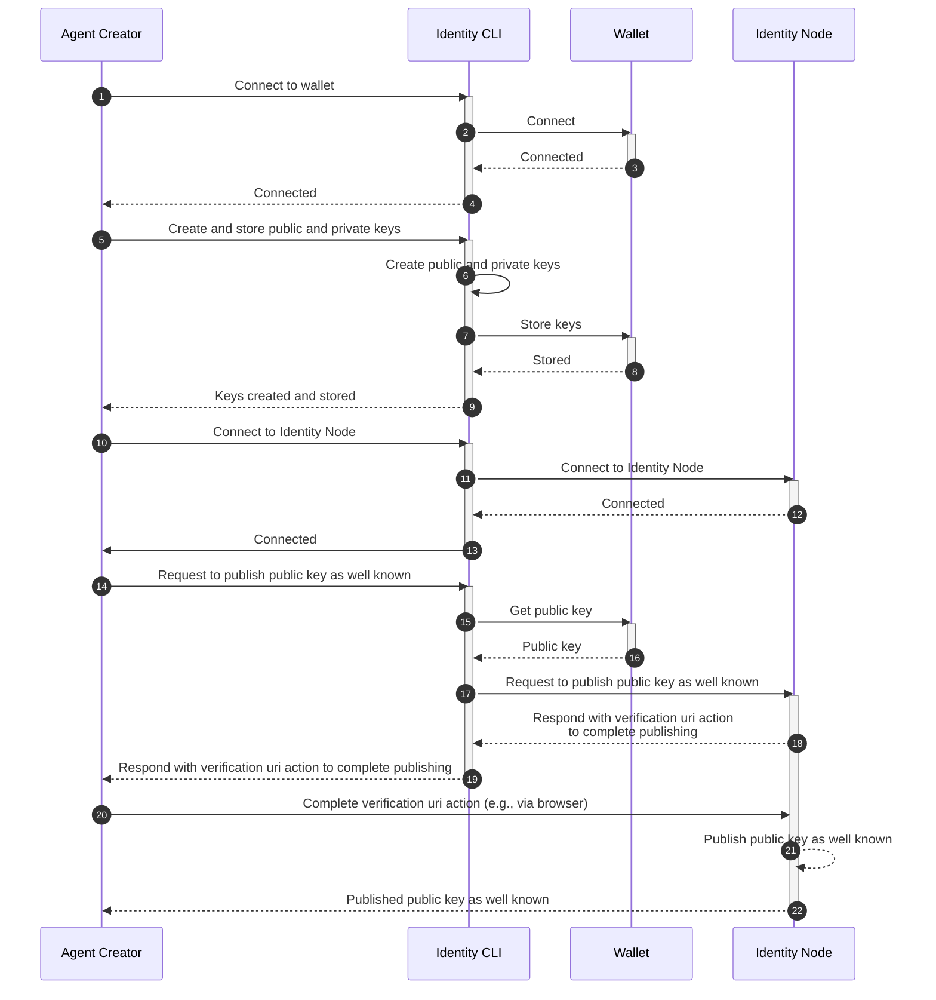

# Identity Flows

## Initial Identity Setup

```mermaid
sequenceDiagram
autonumber

% Connect to wallet
Agent Creator->>Identity CLI: Connect to wallet
activate Identity CLI
Identity CLI->>Wallet: Connect
activate Wallet
Wallet-->>Identity CLI: Connected
deactivate Wallet
Identity CLI-->>Agent Creator: Connected
deactivate Identity CLI

% Create public and private keys
Agent Creator->>Identity CLI: Create and store public and private keys
activate Identity CLI
Identity CLI->>Identity CLI: Create public and private keys
Identity CLI->>Wallet: Store keys
activate Wallet
Wallet-->>Identity CLI: Stored
deactivate Wallet
Identity CLI-->>Agent Creator: Keys created and stored
deactivate Identity CLI

% Connect to Identity Node
Agent Creator->>Identity CLI: Connect to Identity Node
activate Identity CLI
Identity CLI->>Identity Node: Connect to Identity Node
activate Identity Node
Identity Node-->>Identity CLI: Connected
deactivate Identity Node
Identity CLI->>Agent Creator: Connected
deactivate Identity CLI

% Publish public key as well known
Agent Creator->>Identity CLI: Request to publish public key as well known
activate Identity CLI
Identity CLI->>Wallet: Get public key
activate Wallet
Wallet-->>Identity CLI: Public key
deactivate Wallet
Identity CLI->>Identity Node: Request to publish public key as well known
activate Identity Node
Identity Node-->>Identity CLI: Respond with verification uri action<br/>to complete publishing
Identity CLI-->>Agent Creator: Respond with verification uri action to complete publishing
deactivate Identity CLI
Agent Creator->>Identity Node: Complete verification uri action (e.g., via browser)
Identity Node-->>Identity Node: Publish public key as well known
Identity Node-->>Agent Creator: Published public key as well known
deactivate Identity Node
```

